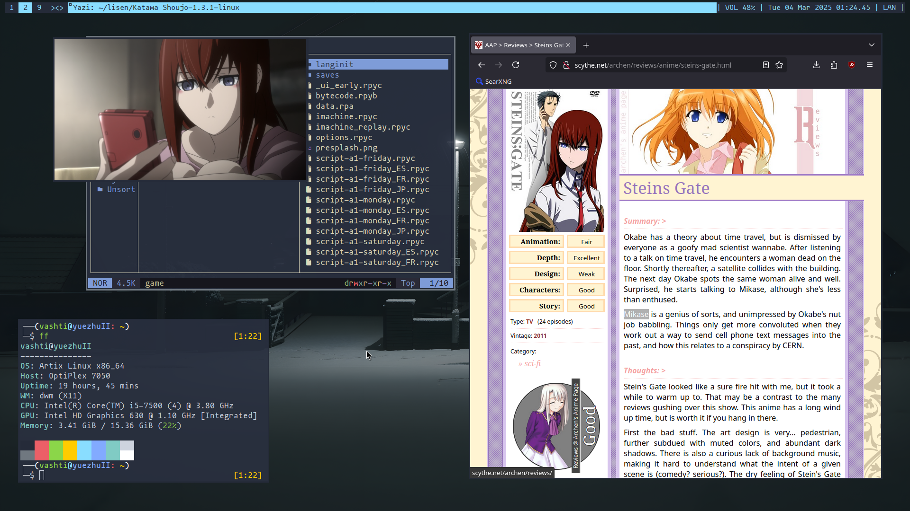

# ax
===
#### This is my very personalized automated installation script for my machines. Stripped version of [LARBS](https://larbs.xyz)
--------





## Installation:

Check out my wiki of Artix Installation [here](https://github.com/LisenHatson/ax/wiki)

On an Arch-based distribution as root, run the following:

```
git clone https://github.com/LisenHatson/ax
cd ax
sh ax.sh
```

That's it.
